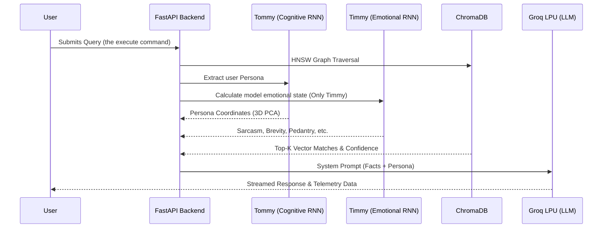
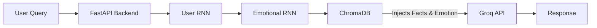
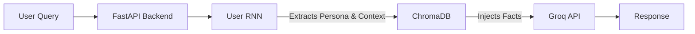
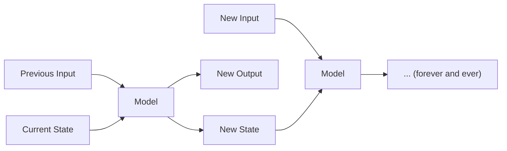

## Timmy & Tommy

### Purpose
Timmy & Tommy are meant to be research assistants using retrieval-augmented generation (RAG) engines to collect subject specific information relevant to the user's query to provide more accurate and source supported answers. 
Additionally, it automatically computes the user's profile, which is injected into the context window of the model to provide the final prompt. 

Live Application: [Link to Timmy](http://143.198.183.98:8000/)
(The site is hosted live on DigitalOcean. To avoid high fees, it can support up to about 5 people using it at the same time (assuming they're not spamming it, in which case the slowapi limits kick in and allows 2 people to use it at once))

#### Some Terminology Use 
- Vectors: I occasionally use "vector" to represent claim. This is because in the ChromaDB vector database, each entry is represented by a vector, which is used to perform search with. This vector has an id (a link) back to the original claim that produced that vector (the claim gets passed through something called an embedder to create the vector, the vector is also known as an embedding)

### Industry Performance Metrics 
Instead of just relying on me saying it works, I will be adding benchmarks here in the future. All tests are provided from YLab in their **Bridge Benchmark**, accessed through their Hugging Face page. Here is where the tests are held: [YLab-Open/Bridge-Open](https://huggingface.co/datasets/YLab-Open/BRIDGE-Open/blob/main/Example.zip). 

Future iterations of Timmy and Tommy (and other models of the Timmy and Tommy family when I get to those), will be benchmarked using these benchmarks. 

Reference: Wu, J., Gu, B., et al. BRIDGE: benchmarking large language models for understanding real-world clinical practice texts. Nature Biomedical Engineering (2026).

Currently, the model's database is not complete (I am currently migrating over to a different database type), so I'm only completing one example test until then. 

1. Dataset: MEDIQA 2019-RQE (NLI) 
    - Accuracy: 100.00%
    - **Total Graded: 5 (there are only 5 questions in the example test dataset)** (Timmy has yet to conquer the medical field)
    - Text provided to the model: Testing Query 5...
Given the following two clinical questions labeled as "Question A" and "Question B", determine if the answer to "Question B" is also the answer to "Question A", either exactly or partially.
Return your answer in the following format. DO NOT GIVE ANY EXPLANATION:
answer: label
The optional list for "label" is ["true", "false"]. 
Question A: "Can Tegretol raise the gamma-glutamyl transferase?"
Question B: "Can Tegretol raise the gamma-glutamyl transferase?"

For my benchmark methodology, see benchmark.md in this repo. 

This is mostly to check that the model works, not to vouch for the actual performance of the model. I will eventually put this into a nice table. 

### Project Architecture
User queries are interpreted by multiple RNNs along the way (additional layers will be added in the future), before relevant claims are found in the vector database. 

**Timmy Architecture**

**Tommy Architecture**

##### RNN Layers
**What are recurrent neural networks (RNNs)?**
These are essentially models that in addition to the normal neural network which produces an output, has a state. This state modifies how the model responds to the same input. 

For example, a teacher annoyed with/at you would provide a different answer to "What is the powerhouse of the cell" compared to one who is in the state of teaching. Similarity, the RNNs listed below react differently to your previous query depending on the state that it was in. 

Transformers have more or less completely replaced RNNs in Natural Language Processing (NLP) because they are able to capture global attention far better and in a less computationally expensive way. For this particular application, it doesn't matter because I am using an embedder to "translate"  the text into something easy to interpret and process. 

Additionally, transformers require far more compute resources than RNNs (the current RNNs are only about 100 kb each, and are in my Digital Ocean CPU server), if I wanted to use transformers I would have to rent out a GPU server, which are far more expensive and do about the same thing.

**Current Layers**
There are currently two RNN layers that are being used by the models. These are used to figure out the user's persona (which changes how specific the response should be), and the model's persona (my first attempt at "simulating" emotion for an LLM)
The first and second RNNs only serve as prompt injection functions. I don't have access to the weights hosted on Groq, so this is the only way I can modify its behavior. 

1. User Persona RNN (Timmy and Tommy): Calculates the user's semantic intent and maps it to one of the personas (currently there are only 4) in a 64-dimensional latent space (I want to add many new personas in the future, which is why the latent space is a much higher dimension than is currently required).

2. Emotional RNN (Timmy): Modifies a vector depending on user input to change the state of the model. These vectors are then interpreted into English to be injected into the context window. 

**Future Layers to create** 
1. Safety Layer (Tommy): Currently, vectors are found regardless of how dissimilar to the user query the vector is (I am using the top-k results, so it will always find the top k results). Because Tommy is meant to be more of a tool and less of a fun chat, I am going to implement a layer that rejects queries that the model can't support. (This can be done with the similarity values, but I've noticed it is always very high, hence the need of another model to catch this)
2. Chat Authority Layer (Timmy): Currently, when Timmy reaches his breaking point (in terms of annoyance), he makes threats of not talking anymore, so its pretty strange when he continues to respond afterwards. I think emotion without authority feels quite unhuman (inhuman?) so to make the Timmy chat feel more authentic, I am going to create an RNN layer that has separate values to decide when to stop interacting with the user. 

**The vector Database**
This is powered by a ChromaDB (the DB stands for database). It uses Hierarchical Navigable Small World (HNSW) graph traversal to identify similar vectors. 

- Hierarchical Navigable Small World (HNSW): This is very cool. Instead of performing a linear search to find the vectors that are similar each time (O(n)), it instead only compares it to a couple vectors along the way. It gets reduced down to O(log(n)) (big reduction!)
    - Imagine you are searching for your friend in a different country. Instead of looking through every single house on the planet (which is what hte linear search would do), you first find out which country they're living in (you find the vector representing that area, and you go to it). Then, you find the city they're living in (and you go to the vector representing that area). Then the ward, the neighborhood, the block, and finally when the search space is small enough, you can perform a linear search. This is essentially how HNSW works (except with vectors) 

Although this is very efficient, it only calculates the similarity between vectors, which do not perfectly represent the claims that they embed. In the future, I want to create a cosine similarity model that can "rerank" the similar claims to find out which ones are truly the most similar. (I put rerank in quotations because it is an actual method, but I haven't looked into it too much)

#### Architectural Decisions and trade offs
Running large LLMs is very very expensive (not to mention you have to be very smart to do it), which is why I did not go with this option. For this project, I wanted to create something cheap, usable, cheap, fast, not have a horrible user experience and cheap. Here are some of the decisions made along the way to create this project.

**Why ChromaDB locally instead of Pinecone/Cloud DB?**
Running ChromaDB in-memory on the local server means I don't have to wait for a different service to respond with the information (network latency), and then send the request. Pinecone is more meant for production applications for when you don't want to deal with the infrastructure. Although the effect is not too large (<100 ms), it is one of the nice byproducts of the real reason I chose ChromaDB. 

Its free. 

**Why use RNNs instead of LLM to guess the persona?**
Using an LLM to classify user personas is pretty expensive (instead of a single query, you're sending two, even if its to a weaker model). Because I am using the Groq free tier (more details on that later), I am constrained to about 30 requests per minute, if I were to use a model to classify user personas, I would essentially cut that down the 15 per minute. 

The custom RNN sits within my Digital Ocean (shared) server, runs basically instantly, and is free. 

**Why the Groq API instead of hosting Qwen locally or on a cloud provider**
This was one of the concerns that I had when I was creating the project: "If I just use an external inference provider, then its basically just a ChatGPT (groq in this case) wrapper." Which is definitely not what I wanted my project to look like. Then, I realized, the reason Chat GPT wrappers have a bad reputation is because they are extremely cost ineffective (or its because it shows you haven't done anything, which I also agree with, I am coping :C). 

I first used Modal (a cloud provider) to host my own model, and to spin up on a query from the front end. However, using this method doesn't provide me any guardrails for someone creating a script to drive up my cloud costs. Additionally, hosting the large models (OSS 120b) would require me to use the expensive B200 GPUs, which would quickly drain my budget. The GPU would also be very underutilized in this project. 

I finally decided to go with Groq instead, it has a very generous free tier, runs faster than cloud GPUs (there is no cold start -> the cold start alone would be a couple minutes because of the large model sizes) and provides an easily accessible API to get responses from. Alas, I have swallowed my pride for a service that is free. 

**Changes Along the Way**
- Initial user interface made by Streamlit, but this doesn't create a lot of customizability options, so I switched over to a FastAPI backend and a Tailwind CSS and HTML front end (Gemini did a lot of work on that, and I changed a couple things for that). 
- Environment variables saved within an env file on Digital Ocean, previously was in a Streamlit.toml secrets file
- PyTorch did not load in properly because it went over the 2GB of RAM given to me on the server (so the project shut down when it increased over that). Increases in RAM were a lot more expensive, so instead, I used the SSD as virtual memory (a lot slower, but makes sure nothing shuts down)
- In case someone tries to rate-limit abuse the program to drive up cloud and API costs, rate-limiting is used. There's nothing in the loop that could force me to spend money, so I am mostly safe there (just in case some mega smart hacker gets into Digital Oceans servers of Groq, and decides they really don't like and me and only screws  me over).
  - However, there are still ways that people can mess with the system and deny service for others (DDOS!). To  prevent API abuse and control inference costs, I used slowapi for rate limiting (15 requests/minute) (allows two users to consume the entire limit if they're not reading anything)

**The user persona and personality graphs**
Plotly used to render the live 3D Principal Component Analysis (PCA) of the user's persona. 
- I had to use a PCA because I am using a 64-dimension vector to represent the user persona. The PCA finds the 3 most significant components (the principal components), and those are the ones that get displayed, so you get as much as possible for a feeble 3d being to comprehend (you lose all the information in the remaining 61 dimensions).  In the future, there will be many more user personas (which is why the latent space is very large, so it can capture the complexity of the different user profiles). 

#### Model Creation and Miscellaneous
**Persona Training Data**
User input is processed through a PyTorch feature extractor (S-PubMedBert-MS-MARCO). It is only good for medical data, and I will need to get a different embedder in the future for other fields. 
- To create the user profile data, I used OpenAI API to simulate the conversations of each persona. These were then passed through an embedder to create a vector representing that persona. 
- I then used triplet loss, this takes in 3 different vectors, two of which are similar, and one is different to get pushed away. (I give it 2 synthetic medical conversations, and one mathematician one, to train, the model tries to group the medical chats closer together and push away the mathematician) 
- This ends with a vector for each persona, where they are as separated as can be. 
- The user's chat is passed through an embedder, plopped into the latent space, and the distance between the user latent space and each user persona is calculated, and the one you are closest to is the one you are assigned. 
  - This injects a prompt into the context window for Groq, where it will react accordingly.
  - I want to have a more gradual shift from one persona to another in the future (rather than a border that completely changes how it reacts) 

#### Things to do in the future
Multi-shot prompts: Currently, Timmy only prompts a single time, it finds similar data, and then it writes it to you. However, this misses out on a lot of information. For example, if I ask about Hyper IgE, it provides me information about the condition, but does not tell me the cure or the cause. With multi-shot prompts, it would ask multiple things to try to find the things that aren't explicitly linked to the query. 
- The models with multi-sho prompts will be named Tim and Tom (The model afterwards will be Timothy and Tomothy

CPU-Based Reranking: Adding a cross-encoder (ms-marco-MiniLM) to re-score the initial ChromaDB retrieval results before final LLM synthesis to maximize source accuracy.

### Cost Breakdown 
(If I had actually used it with the normal costs, not counting credits. I will indicate where my credits are from (I have not spent any money on anything here))

One Time (if you never retrain or augment dataset):
$19.36

Recurring for hosting fees (inference costs aren't included): 
$12 per month

Local CPU training will be listed as free because I can't quanitfy the amount of compute used. 

**Data Acquisition**: $0.00
- Currently, data scraped from from Europe PubMed Central (PMC) and Wikipedia
    - Free (thank you world)
- Scraping performed locally (currently, may be switched to a parallel CPU on a cloud platform instead)    

**Model Training**: $19.36 total
- Pretrained models collected from Hugging Face 
    - Free
- Additional training run on Modal and locally
    - Recurrent Neural Networks trained locally on CPU (Free)  
    - The NER model was created in another project (see [this repo](https://github.com/Licheng-Zheng/MLAR-Outside/blob/master/README.md) for cost analysis)
        - Cost of this model was about $5.78
    - No models required GPU compute
- Training Data
    - Synthetic data generated by OpenAI 
        - User Persona Information: 60k Input Tokens at 2.50 per million, 431k Output Tokens at 15 per million using GPT-5.4 2026-03-05
            - 0.00015 for input, 6.47 for output - 6.47 total
        - Timmy Personality Information: 2.319M Input tokens at 0.75 per million, 2.477M Output Tokens at 4.50 per million using GPT-5.4 mini 2026-03-17
            - 1.74 for input, 11.15 for output - 12.89 total
        - If data sharing, 250k tokens for larger models and 2.5M tokens for smaller models daily. If you split up the generation tasks across multiple days, it is made for free. (I miscalculated and accidentally spent a dollar :c )
- Embedding Calculation
    - Model from Hugging Face (Free)
    - Embeddings for ChromaDB computed Locally (Free)

**Vector Storage**: $0
- Locally stored on Chroma DB 
    - About 300 mb on the server (Free)
    - Cloud hosted vector databases are a lot more expensive

**Hosting**: 12 dollars per month
- Hosting on Digital Ocean
    - 2 GB of RAM, 50 GB of Storage, NYC1 Server (New York City), 1 virtual CPU running Ubuntu 24.04 Operating System, IPv6 
    - 12 Dollars per month as long as it stays under 2TB of outbound data
    - This is what runs the RNNs as well  (on the vCPU)
    - Free from Github student developer plan (200 dollars in credits or one year)
    - Will require getting a domain

**Live LLM Inference**: Cost is not included because its usage dependent
- Groq LPU Inference. The costs are based on token consumption (rather than a fixed amount, not sure how this is supposed to be calculated). These are all the different models that I use
    - `qwen/qwen3-32b`: 0.29/M tokens input and 0.59/M tokens output 
    - `meta-llama/llama-4-scout-17b-16e-instruct`: 0.11/M tokens input and 0.34/M tokens output
    - `llama-3.3-70b-versatile`: 0.59/M tokens input and 0.79/M tokens output
    - On the free plan so the resources are free for a certain limit 

